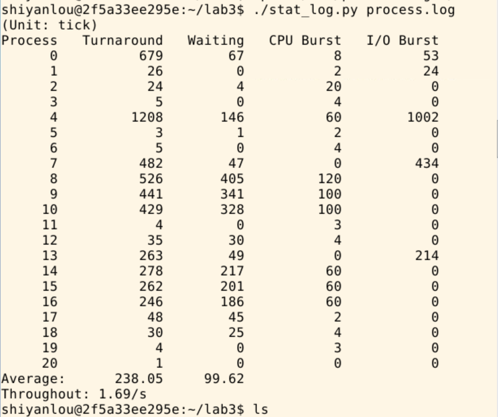
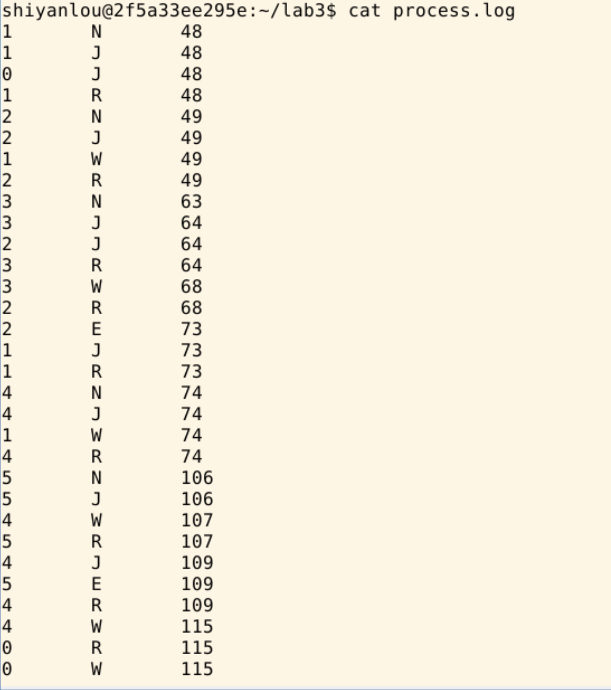

# HIT-Linux0.11-lab3

* 哈工大操作系统实验系列连载：</br>
    * [lab1 lab2](https://github.com/wwyqianqian/HIT-Linux0.11-lab-1and2)
    * [本篇 lab3](https://github.com/wwyqianqian/HIT-Linux0.11-lab3)

### Lab3

进程从创建（Linux 下调用 fork()）到结束的整个过程就是进程的生命期，进程在其生命期中的运行轨迹实际上就表现为进程状态的多次切换，如进程创建以后会成为就绪态；当该进程被调度以后会切换到运行态；在运行的过程中如果启动了一个文件读写操作，操作系统会将该进程切换到阻塞态（等待态）从而让出 CPU；当文件读写完毕以后，操作系统会在将其切换成就绪态，等待进程调度算法来调度该进程执行……
本次实验包括如下内容：
* 基于模板 `process.c` 编写多进程的样本程序，实现如下功能：
    * 所有子进程都并行运行，每个子进程的实际运行时间一般不超过 30 秒
    * 父进程向标准输出打印所有子进程的 id，并在所有子进程都退出后才退出

* 在 Linux0.11 上实现进程运行轨迹的跟踪。基本任务是在内核中维护一个日志文件 `/var/process.log`，把从操作系统启动到系统关机过程中所有进程的运行轨迹都记录在这一 log 文件中。`/var/process.log` 文件的格式必须为：
	```
	pid    X    time
	```
	* pid 是进程的 ID
	* X 可以是 N、J、R、W 和 E 中的任意一个，分别表示进程新建(N)、进入就绪态(J)、进入运行态(R)、进入阻塞态(W) 和退出(E)
	* time 表示 X 发生的时间。这个时间不是物理时间，而是系统的滴答时间(tick)
	* 三个字段之间用制表符分隔。例如：
	```
	12    N    1056
	12    J    1057
	4    W    1057
	12    R    1057
	13    N    1058
	13    J    1059
	14    N    1059
	14    J    1060
	15    N    1060
	15    J    1061
	12    W    1061
	15    R    1061
	15    J    1076
	14    R    1076
	14    E    1076
	......
	```

* 在修改过的 0.11 上运行样本程序，通过分析 log 文件，统计该程序建立的所有进程的等待时间、完成时间（周转时间）和运行时间，然后计算平均等待时间，平均完成时间和吞吐量。可以自己编写统计程序，也可以使用 python 脚本程序—— `stat_log.py`（在 `/home/teacher/` 目录下） ——进行统计。
* 修改 0.11 进程调度的时间片，然后再运行同样的样本程序，统计同样的时间数据，和原有的情况对比，体会不同时间片带来的差异。
* 要求：
    - process.c，50%
    - 日志文件建立成功，5%
    - 能向日志文件输出信息，5%
    - 5 种状态都能输出，10%（每种 2 %）
    - 调度算法修改，10%
    - 实验报告，20%

* run
    ```
    $ cd linux-0.11
    $ make all
    $ cd ..
    $ sudo ./mount-hdc
    $ cp process.c ./hdc/usr/root
    $ ./run

    ```
    进入模拟器后

    ```
    $ gcc -o process process.c
    $ ./process
    $ ls -la /var
    $ sync
    ```
    返回实验楼虚拟机
    ```
    $ sudo ./mount-hdc
    $ cp hdc/var/process.log ./
    $ chmod +x stat_log.py
    $ ./stat_log.py process.log
    ```

* 实验截图


